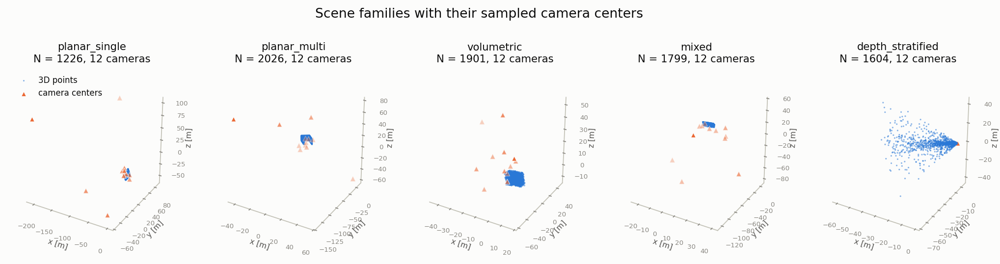
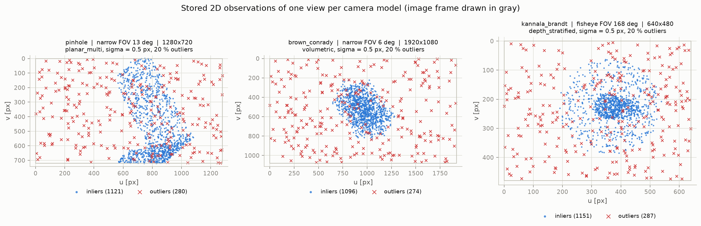
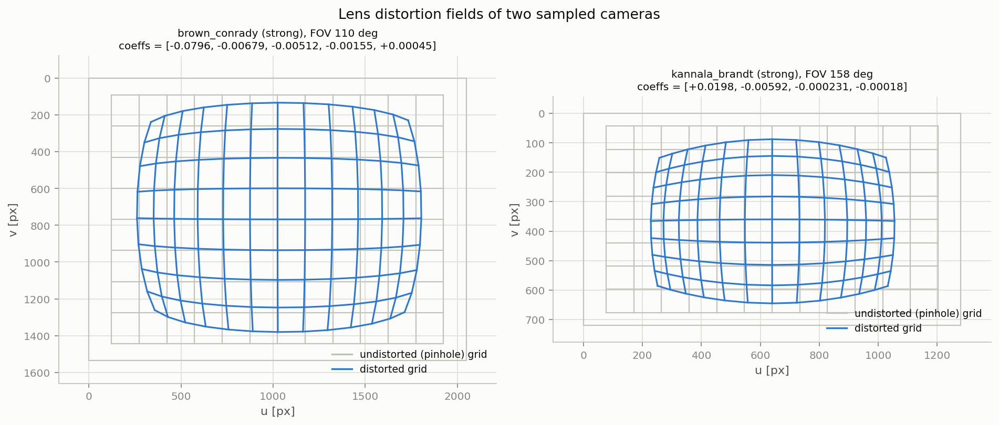
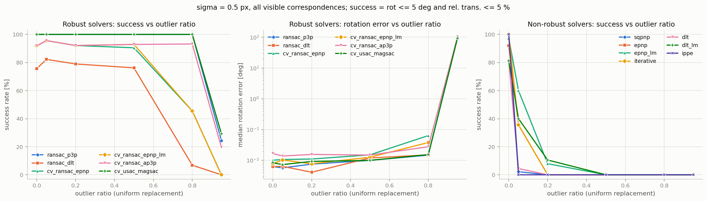
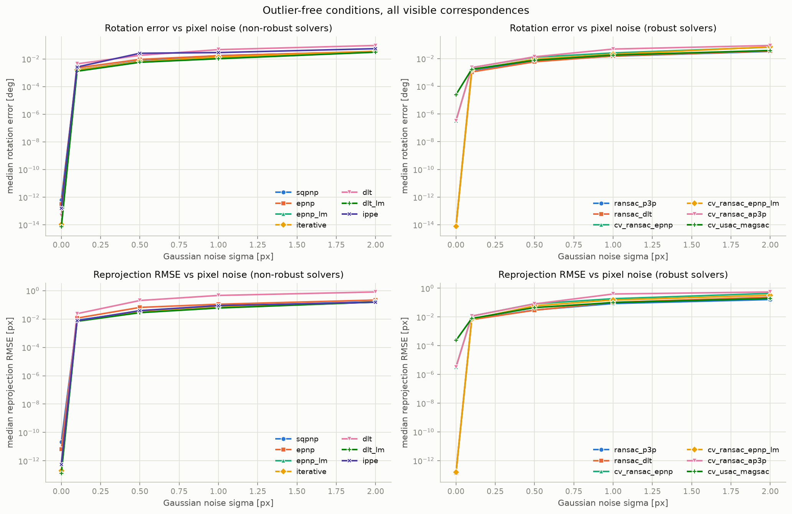
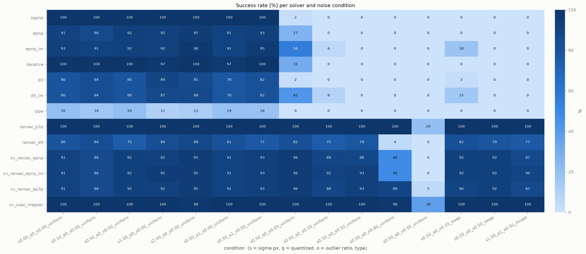

# PnPCorrespondences

**A large, systematic, image-free dataset of 2D–3D point correspondences with exact ground truth, for benchmarking camera calibration, Perspective-n-Point (PnP) solvers, robust estimators and bundle adjustment.**

[](https://huggingface.co/datasets/Ezharjan/PnPCorrespondences)
[](LICENSE)
[](https://creativecommons.org/licenses/by/4.0/)
[](https://www.python.org/downloads/)

This repository contains everything needed to *generate* the dataset from scratch on a laptop, *validate* it, *benchmark* fifteen classical and modern solvers on it (from a from-scratch DLT to SQPnP and MAGSAC++), *analyse* the results, *visualise* dataset and results, and *publish* the dataset on the Hugging Face Hub.

The document is self-contained. Section 5 states the methodology in full: the forward projection model, the four generation steps and the design rules. Every later section documents the implementation that realises it. Sections 1, 5 and 6 are enough to reproduce the dataset with your own code, and Section 5.9 gives a sixty-line reference implementation of the core.

<p align="center">
  
</p>

---

## Contents

1. [Why this dataset](#1-why-this-dataset)
2. [Repository layout](#2-repository-layout)
3. [Quick start](#3-quick-start)
4. [Installation](#4-installation)
5. [Method and dataset design](#5-method-and-dataset-design)
6. [Dataset format](#6-dataset-format)
7. [Size tiers](#7-size-tiers)
8. [Step by step: generating the dataset](#8-step-by-step-generating-the-dataset)
9. [Benchmarks, evaluation and analysis](#9-benchmarks-evaluation-and-analysis)
10. [Visualisations](#10-visualisations)
11. [The one-command pipeline](#11-the-one-command-pipeline)
12. [Housekeeping: caches, disk space and regeneration](#12-housekeeping-caches-disk-space-and-regeneration)
13. [Uploading the dataset to Hugging Face](#13-uploading-the-dataset-to-hugging-face)
14. [Configuration reference](#14-configuration-reference)
15. [Extending the project](#15-extending-the-project)
16. [Troubleshooting](#16-troubleshooting)
17. [Design decisions and known limitations](#17-design-decisions-and-known-limitations)
18. [License and citation](#18-license-and-citation)

---

## 1. Why this dataset

Camera calibration is a foundational problem in 3D computer vision: it establishes the mathematical relationship between the 3D world and its 2D image projections. Calibration from images of checkerboard or ChArUco targets is the standard practice, but *evaluating* modern PnP solvers, bundle-adjustment algorithms and neural calibration networks needs something the standard practice cannot give: vast, precisely controlled data with unquestionable ground truth.

Evaluating those methods on real images confounds many error sources at once: lighting, motion blur, corner-detector bias, mismatched features. A dataset built purely from 2D–3D point correspondences isolates them. Every sample here is a set of 3D world points, their 2D pixel observations, and the *exact* intrinsics, distortion and extrinsics that produced them, so that every deviation of an estimate is attributable to the solver and to a controlled, labelled perturbation:

| Controlled factor | Levels in the dataset |
|---|---|
| Scene structure | single plane (calibration target), 2–4 orthogonal room planes, volumetric box, wall + volume, depth-stratified corridor (0.5 m … 50 m) |
| Camera model | pinhole, Brown–Conrady (k1, k2, p1, p2, k3), Kannala–Brandt fisheye (k1 … k4) |
| Field of view | narrow 5–20° (telephoto), normal 40–75°, wide 80–120°, fisheye 130–175° |
| Distortion strength | none, mild, strong (defined by the displacement at the image corner) |
| Sensor resolution | 640×480 … 3840×2160 |
| Pixel noise | σ = 0, 0.1, 0.5, 1.0, 2.0 px |
| Quantization | sub-pixel or integer pixel grid |
| Outlier ratio | 0 %, 5 %, 20 %, 50 %, 80 %, 95 % |
| Outlier type | uniform replacement, swapped assignments, mixed |
| Number of correspondences | 20 … 2 500 per view (any subset size can be evaluated) |

The generator is deterministic: every array is a pure function of a master seed, so the full dataset can be regenerated bit-for-bit on any machine (the validator checks this).

Because no raster data is involved, the dataset is also cheap: there are no images to decode, storage is roughly 19 bytes per correspondence, and a 300-million-correspondence release fits in about 6 GB. What it buys is absolute ground truth for probing the limits of calibration and pose-estimation algorithms, at the price of not modelling image formation itself (Section 17).

## 2. Repository layout

```
PnPCorrespondences/
├── README.md                   this document: methodology, usage and results
├── LICENSE                     MIT license
├── CITATION.cff                machine-readable citation (GitHub "Cite this repository")
├── requirements.txt            pip requirements (pip install -r requirements.txt)
├── pyproject.toml              optional: pip install -e .  (package name: pnpcorr)
├── configs/                    size tiers and variants of the generator configuration
│   ├── smoke.yaml              5 scenes, 60 samples, seconds        (installation check)
│   ├── small.yaml              30 scenes, 5 400 samples, ~150 MB    (development)
│   ├── full.yaml               400 scenes, 288 000 samples, ~6 GB   (the dataset)
│   ├── xl.yaml                 1 000 scenes, 1.2 M samples, ~25 GB
│   └── factorial.yaml          full factorial design of the noise factors (42 conditions)
├── pnpcorr/                    the library (pure Python, NumPy/SciPy; OpenCV optional)
│   ├── config.py               defaults, YAML loading, validation, scene/split enumeration
│   ├── cameras.py              intrinsics, distortion (forward + inverse), projection, culling
│   ├── scenes.py               the five scene families
│   ├── poses.py                look-at construction, hemisphere and corridor pose sampling
│   ├── noise.py                Gaussian noise, quantization, outlier injection
│   ├── generate.py             deterministic seeding, multiprocessing, orchestration
│   ├── storage.py              HDF5 writer / reader, manifest, JSON examples
│   ├── validate.py             structural, numerical and reproducibility checks
│   ├── solvers.py              DLT, LM, RANSAC (from scratch) + OpenCV solvers + calibration
│   ├── metrics.py              rotation / translation / reprojection / intrinsic / inlier metrics
│   ├── benchmark.py            stratified sampling and the four benchmark tasks
│   ├── analysis.py             summary tables (CSV + Markdown)
│   ├── plots.py                dataset and benchmark figures
│   └── hf.py                   Hugging Face dataset card and upload helpers
├── scripts/                    command-line entry points (thin wrappers around pnpcorr)
│   ├── generate_dataset.py     generate                 -> data/
│   ├── validate_dataset.py     validate                 -> data/metadata/validation_report.json
│   ├── export_examples.py      JSON examples            -> data/examples/
│   ├── run_benchmark.py        benchmarks               -> results/*.csv
│   ├── analyze_results.py      tables + summary         -> results/tables/, results/summary.md
│   ├── make_figures.py         figures                  -> docs/figures/*.png
│   ├── build_dataset_card.py   Hugging Face README      -> data/README.md
│   ├── upload_to_huggingface.py upload data/ to the Hub
│   ├── run_pipeline.py         everything above, in order
│   └── clean_caches.py         delete every cache in one command (never the data)
├── tests/                      pytest suite (projection is checked against OpenCV)
├── examples/quickstart.py      load one sample and solve it with several solvers
└── docs/                       version-controlled documentation (committed, not ignored)
    ├── figures/                the 13 figures the README embeds and links (Section 10);
    │                           `make_figures.py` writes here, replacing them in place
    └── small_tier_summary.md   the full benchmark summary quoted in Section 9.6
```

Generated artefacts (`data/`, `results/`, `runs/`, and a root-level `figures/` if you ask for one) are written next to the code and are not tracked by git. Caches are untracked too and are removed by `python scripts/clean_caches.py` (Section 12). No script deletes a dataset or anything under `docs/`.

## 3. Quick start

```bash
git clone https://github.com/Ezharjan/PnPCorrespondences.git
cd PnPCorrespondences
python -m venv .venv && source .venv/bin/activate      # Windows: .venv\Scripts\Activate.ps1
pip install -r requirements.txt
python -m pytest -q                                      # ~10 s, everything must pass
python scripts/run_pipeline.py --config configs/smoke.yaml --out-root runs/smoke --workers 2
python examples/quickstart.py --data runs/smoke/data
```

The smoke pipeline generates a tiny dataset, validates it, exports JSON examples, runs every benchmark, writes the summary tables and figures and the dataset card, all in about one minute. The full dataset is produced by the same command with `configs/full.yaml` (Section 8). Afterwards, `python scripts/clean_caches.py` removes every cache the run left behind and touches nothing else (Section 12).

## 4. Installation

Requirements: Python 3.9 or newer (3.10–3.12 recommended), about 8 GB of free disk for the `full` tier (25 GB for `xl`), and any operating system. The scripts are pure Python and were tested on Linux; they use `pathlib` and `multiprocessing` with the `spawn` start method, so they run unchanged on Windows.

**Windows (PowerShell)**

```powershell
git clone https://github.com/Ezharjan/PnPCorrespondences.git
cd PnPCorrespondences
py -3 -m venv .venv
.\.venv\Scripts\Activate.ps1
python -m pip install --upgrade pip
pip install -r requirements.txt
python -m pytest -q
```

If PowerShell refuses to run the activation script, run once: `Set-ExecutionPolicy -Scope CurrentUser RemoteSigned`.

**Linux / macOS**

```bash
git clone https://github.com/Ezharjan/PnPCorrespondences.git
cd PnPCorrespondences
python3 -m venv .venv
source .venv/bin/activate
python -m pip install --upgrade pip
pip install -r requirements.txt
python -m pytest -q
```

`requirements.txt` installs NumPy, SciPy, h5py, pandas + pyarrow (Parquet manifest), PyYAML, tqdm, OpenCV (`opencv-python`, solvers), matplotlib (figures), `huggingface_hub` (upload) and pytest. Both OpenCV 4.x and 5.x work. The fisheye calibration flags moved from `cv2.fisheye` to the top-level namespace in 5.0, and the code accepts either spelling; the test suite is run against both. OpenCV is optional for *generation*: the generator, the validator and the from-scratch solvers only need NumPy/SciPy. Optionally install the library in editable mode with `pip install -e .`; the scripts also work without installation because they add the repository root to `sys.path`. (If you already have the sources in another folder, skip the `git clone` line and `cd` there instead.)

## 5. Method and dataset design

This section is the complete methodology. Generating synthetic correspondences means simulating the *forward* projection model of a camera rigorously, mapping a 3D point in the world to a 2D pixel, and then perturbing the result in controlled, labelled ways. Section 5.1 states the projection model; Sections 5.2 to 5.6 are the four generation steps in order (scene geometry → poses → projection and filtering → noise); Section 5.7 covers determinism, 5.8 the deliberately hard configurations and 5.9 a minimal reference implementation.

All quantities are in metres and pixels. Conventions are those of OpenCV; the projection code is verified against `cv2.projectPoints` and `cv2.fisheye.projectPoints` to 10⁻⁸ px in the test suite.

### 5.1 The projection model

Let a 3D point in the world frame be the homogeneous vector $\mathbf{X}_w = [X, Y, Z, 1]^\top$. The camera pose (extrinsics) is a rotation $\mathbf{R} \in SO(3)$ and a translation $\mathbf{t} \in \mathbb{R}^3$, and the point is carried into the camera frame by

$$\mathbf{X}_c = \begin{bmatrix} \mathbf{R} & \mathbf{t} \\ \mathbf{0} & 1 \end{bmatrix} \mathbf{X}_w, \qquad\text{that is}\qquad \mathbf{X}_c = \mathbf{R}\,\mathbf{X}_w + \mathbf{t}.$$

It is then projected onto the normalised image plane:

$$x_n = \frac{x_c}{z_c}, \qquad y_n = \frac{y_c}{z_c}.$$

Real lenses deviate from the ideal pinhole, and a dataset that ignores this cannot measure how a solver copes with it. Lens distortion maps $(x_n, y_n)$ to $(x_d, y_d)$; three models are used:

* **pinhole** — identity.
* **Brown–Conrady** (`dist_coeffs = (k1, k2, p1, p2, k3)`, OpenCV order), with $r^2 = x_n^2 + y_n^2$:

$$x_d = x_n\,(1 + k_1 r^2 + k_2 r^4 + k_3 r^6) + 2 p_1 x_n y_n + p_2 (r^2 + 2 x_n^2)$$

$$y_d = y_n\,(1 + k_1 r^2 + k_2 r^4 + k_3 r^6) + p_1 (r^2 + 2 y_n^2) + 2 p_2 x_n y_n$$

  where $k_i$ are the radial and $p_i$ the tangential coefficients. This is the standard *plumb-bob* model for perspective lenses.

* **Kannala–Brandt fisheye** (`dist_coeffs = (k1, k2, k3, k4)`) — for wide-angle lenses the incidence angle $\theta = \arctan r$ is distorted instead of the radius:

$$\theta_d = \theta\,(1 + k_1\theta^2 + k_2\theta^4 + k_3\theta^6 + k_4\theta^8), \qquad (x_d, y_d) = \frac{\theta_d}{r}\,(x_n, y_n).$$

Finally the distorted point is mapped to pixels by the intrinsic matrix, with skew $s$:

$$\mathbf{K} = \begin{bmatrix} f_x & s & c_x \\ 0 & f_y & c_y \\ 0 & 0 & 1 \end{bmatrix}, \qquad u = f_x x_d + s\,y_d + c_x, \quad v = f_y y_d + c_y .$$

`pose_Rt` stores the 4×4 matrix $\begin{bmatrix}\mathbf{R} & \mathbf{t}\\ \mathbf{0} & 1\end{bmatrix}$ (world → camera); the camera centre is $\mathbf{C} = -\mathbf{R}^\top \mathbf{t}$.

### 5.2 Step 1 — synthesising the 3D scene geometry

Do not scatter 3D points uniformly through space: real scenes have structure, and a solver's behaviour depends on it. Three structural ingredients are combined:

1. **Planar structures** — grids of points on distinct 3D planes, simulating walls and calibration targets.
2. **Volumetric structures** — points inside bounding boxes, simulating room interiors and general scenes.
3. **Depth stratification** — points spanning a wide depth range (0.5 m to 50 m here) so that depth-dependent calibration phenomena become measurable inside a single view.

Five scene families are generated in a canonical frame and then moved by a random rigid transform, so the world frame carries no special structure (the transform is stored as `frame_R`, `frame_t`). Each scene has N ∈ [500, 2 000] points (`full` tier) inside a box of edge 4–20 m. Points on planes are laid out either as a regular grid (a calibration target) or uniformly at random; `point_labels` records the plane of every point (−1 for volumetric points).

| `scene_type` | Structure | Purpose |
|---|---|---|
| `planar_single` | all points on one plane | the classic DLT degeneracy; IPPE's domain |
| `planar_multi` | 2–4 orthogonal faces of a room (always the back wall, plus floor / ceiling / side walls) | multi-plane structure, room corners |
| `volumetric` | uniform points inside a box | generic well-conditioned PnP |
| `mixed` | half the points on the back wall, half inside the box (the layout of the reference implementation, Section 5.9) | mixed planar / volumetric |
| `depth_stratified` | points in two nested cones along a corridor, depth log-uniform in [0.5 m, 50 m] | depth-dependent effects, near/far points in one view |

### 5.3 Step 2 — sampling camera poses (extrinsics)

The aim is a diverse set of poses that actually look at the structure. A camera centre $\mathbf{C}$ and a target $\mathbf{T}$ inside the scene define the pose by the *look-at* construction: forward $\mathbf{Z} = (\mathbf{T} - \mathbf{C}) / \lVert\mathbf{T} - \mathbf{C}\rVert$, right $\mathbf{X} = \mathbf{up} \times \mathbf{Z}$ (normalised), true up $\mathbf{Y} = \mathbf{Z} \times \mathbf{X}$, $\mathbf{R} = [\mathbf{X}; \mathbf{Y}; \mathbf{Z}]$ (rows), $\mathbf{t} = -\mathbf{R}\mathbf{C}$, with `up = (0, 1, 0)` and a random roll of ±15° about the optical axis. Camera centres are sampled uniformly (area-wise) on the hemisphere around the structure, above a minimum elevation of 10°, at a distance $d = \phi \cdot r_{\text{scene}} / \tan(\tfrac{1}{2}\min(\text{HFOV}, \text{VFOV}))$ with $\phi \sim U(0.5, 1.8)$, the half-angle capped at 60° and $d \ge 0.35\, r_{\text{scene}}$, so that the structure roughly fills the image whatever the focal length (a 6° telephoto is placed far away, a 150° fisheye close to the structure but not inside it). Depth-stratified scenes use the *corridor* strategy instead: the camera sits at the corridor entrance and looks down it. The look-at target is the scene centre plus a jitter of ±15 % of the scene radius.

### 5.4 Intrinsics and distortion sampling

Every scene receives several *intrinsic sets* (`intrinsics_id`), each reused for several poses (`pose_id`), which is what multi-view calibration benchmarks need. For each set: a camera model is drawn (pinhole 30 %, Brown–Conrady 45 %, Kannala–Brandt 25 %), then a FOV class allowed for that model, a nominal horizontal FOV inside the class range, a resolution, $f_x = \frac{W/2}{\tan(\text{HFOV}/2)}$ (pinhole / Brown–Conrady) or $f_x = \frac{W/2}{\text{HFOV}/2}$ (equidistant fisheye), $f_y = f_x(1 + \mathcal{N}(0, 0.01))$, a principal point within ±3 % of the image centre and, with probability 0.1, a skew of up to ±2 px.

Distortion coefficients are sampled as *effective* coefficients, meaning the relative radial displacement they induce at the image corner, and are then converted to raw polynomial coefficients so that "mild" and "strong" mean the same thing for a 640 px webcam and a 4K wide-angle lens (`distortion_level`; telephoto lenses are always mild). Every polynomial is checked to be **injective** up to the image corner: `valid_radius` stores the largest undistorted radius (Brown–Conrady) or incidence angle (Kannala–Brandt) that still has a unique image, and points beyond it are never projected. For Brown–Conrady the bound is the first radius at which the Jacobian determinant of the *full* map vanishes in any direction. Radial monotonicity alone is not enough: the tangential terms $p_1, p_2$ fold the map earlier, and can fold it even where the radial part is monotonic everywhere.

### 5.5 Step 3 — forward projection and filtering

For every pose and intrinsic set the whole scene is projected with the equations of Section 5.1, and a point is kept when all of the following hold:

1. **frustum culling** — the point is in front of the camera, $z_c > 0$ (`cameras.min_depth`, 0 by default);
2. **domain check** — the normalised point lies inside the invertible domain of the distortion polynomial (Section 5.4);
3. **bounds check** — the pixel falls on the sensor, $0 \le u < W$ and $0 \le v < H$ (half-open, the pixel-index convention).

Views with fewer than `min_visible_points` (20) visible points are rejected and the pose is re-sampled (up to 30 attempts; a view that never succeeds is skipped and counted in `dataset_stats.json`). The exact projections are stored as `points_2d_clean`, together with `point_indices` (into `points_3d`) and `depths`.

### 5.6 Step 4 — noise modelling and injection

This is the step that makes the dataset useful for benchmarking: it is what converts exact geometry into the kind of measurement a real front end produces. Every view is stored under all noise *conditions* of the configuration (15 in the `full` tier), applied to the clean projections in this order:

1. **Gaussian pixel noise** — real corner detectors have sub-pixel jitter, modelled as $\mathcal{N}(0, \sigma^2)$ added independently to $u$ and $v$, with $\sigma$ from 0 to 2 px;
2. **outliers** — feature matching produces mis-associations, so $\lfloor M \cdot \text{ratio} \rfloor$ correspondences are selected at random and either replaced by uniform random positions inside $[0, W) \times [0, H)$ (`uniform`), permuted among themselves with a derangement so every selected 3D point receives the observation of a *different* 3D point (`swap`), or half and half (`mixed`); `outlier_mask` marks every selected correspondence;
3. **quantization** — sensors report integer pixels when no sub-pixel refinement is assumed, so coordinates are rounded to the nearest integer, applied last so that all stored observations, inliers and outliers alike, lie on the sensor grid.

Noisy coordinates are not clipped to the image, so the noise statistics are exact at the border.

| `condition_id` | σ [px] | quantized | outlier ratio | outlier type | name |
|---|---|---|---|---|---|
| 0–4 | 0, 0.1, 0.5, 1, 2 | no | 0 | – | `s0.00_q0_o0.00_uniform` … `s2.00_q0_o0.00_uniform` |
| 5–6 | 0, 0.5 | yes | 0 | – | `s0.00_q1_o0.00_uniform`, `s0.50_q1_o0.00_uniform` |
| 7–11 | 0.5 | no | 0.05, 0.2, 0.5, 0.8, 0.95 | uniform | `s0.50_q0_o0.05_uniform` … `s0.50_q0_o0.95_uniform` |
| 12–13 | 0.5 | no | 0.2, 0.5 | swap | `s0.50_q0_o0.20_swap`, `s0.50_q0_o0.50_swap` |
| 14 | 1.0 | yes | 0.5 | mixed | `s1.00_q1_o0.50_mixed` |

`configs/factorial.yaml` replaces the list by the full factorial design σ × quantization × ratio × type (42 conditions).

### 5.7 Splits, seeds and reproducibility

Scenes are assigned to `train` / `val` / `test` (80 / 10 / 10 %) per scene type, so every split contains every family; the split is a scene attribute and a manifest column. Seeds derive from the master seed through `numpy.random.SeedSequence` spawn keys: `(scene_id, 0)` for the scene, `(scene_id, 3, intrinsics_id)` for intrinsics, `(scene_id, 1, camera_slot)` for poses and `(scene_id, 2, camera_slot, condition_id)` for noise. Generation with 1 or 16 worker processes therefore yields identical files, and `validate_dataset.py --regenerate N` re-creates N scenes and compares them bit-for-bit.

### 5.8 Challenging configurations, by design

A benchmark is only as informative as its hard cases. Three are built into the design rather than left to chance:

| Challenge | Why it matters | How the dataset realises it |
|---|---|---|
| **Planar degeneracies** | With all 3D points on one plane the standard DLT is degenerate and fails without an explicit homography treatment. | The `planar_single` family is *exactly* coplanar (to floating-point rounding), and `planar_multi` / `mixed` contain exactly-planar subsets labelled by `point_labels`. The solvers report `degenerate: coplanar points` instead of returning a silently wrong pose. |
| **Small field of view** | Telephoto lenses show almost no perspective effect, which stresses the numerical stability of every solver and makes the principal point nearly unobservable for calibration. | The `narrow` FOV class spans 5–20° HFOV and is sampled for pinhole and Brown–Conrady cameras; Section 9.6 quantifies the resulting 50–85 px principal-point error in multi-view calibration. |
| **Extreme outlier ratios** | Modern learned PnP solvers (for example graph-neural-network matchers) claim robustness to 80–90 % outliers, which is beyond what a 20 % benchmark can distinguish. | Outlier ratios span 0 %, 5 %, 20 %, 50 %, 80 % and 95 %, in three contamination modes, with the ground-truth `outlier_mask` stored for every sample so that inlier precision and recall are measurable, not just pose error. |

The corresponding evaluation metrics are defined in Section 9.3 and computed by `pnpcorr.metrics`: reprojection RMSE against the clean ground truth, rotation and translation error against the exact pose, and percentage error of $f_x, f_y, c_x, c_y$.

### 5.9 The method in sixty lines

The library adds sampling, validation, serialization and benchmarking, but the core of Sections 5.1 to 5.6 is small enough to read in one sitting. This reference implementation uses only NumPy and produces one noisy view of one scene:

```python
import numpy as np
from scipy.spatial.transform import Rotation as R


def generate_3d_point_cloud(num_points=1000, bounds=(-5, 5)):
    """Structured 3D point cloud: half on a back-wall plane, half in a volume."""
    points_wall = np.random.uniform(bounds[0], bounds[1], (num_points // 2, 3))
    points_wall[:, 2] = 5.0                       # fixed-depth plane
    points_vol = np.random.uniform(bounds[0], bounds[1], (num_points // 2, 3))
    points_vol[:, 2] = np.random.uniform(2.0, 8.0, num_points // 2)
    return np.vstack((points_wall, points_vol))


def project_points(points_3d, K, dist_coeffs, R_mat, t_vec, img_size=(1920, 1080)):
    """Project 3D points to 2D with Brown-Conrady distortion (Steps 1-3)."""
    points_c = (R_mat @ points_3d.T).T + t_vec                    # world -> camera
    valid_z = points_c[:, 2] > 0                                  # frustum culling
    points_c = points_c[valid_z]
    original_indices = np.arange(len(points_3d))[valid_z]

    x_n = points_c[:, 0] / points_c[:, 2]                         # normalised plane
    y_n = points_c[:, 1] / points_c[:, 2]

    k1, k2, p1, p2, k3 = dist_coeffs                              # radial + tangential
    r2 = x_n ** 2 + y_n ** 2
    radial = 1 + k1 * r2 + k2 * r2 ** 2 + k3 * r2 ** 3
    x_d = x_n * radial + 2 * p1 * x_n * y_n + p2 * (r2 + 2 * x_n ** 2)
    y_d = y_n * radial + p1 * (r2 + 2 * y_n ** 2) + 2 * p2 * x_n * y_n

    u = K[0, 0] * x_d + K[0, 1] * y_d + K[0, 2]                   # intrinsics
    v = K[1, 1] * y_d + K[1, 2]

    valid_uv = (u >= 0) & (u < img_size[0]) & (v >= 0) & (v < img_size[1])
    return np.vstack((u[valid_uv], v[valid_uv])).T, original_indices[valid_uv]


def inject_noise_and_outliers(points_2d, noise_std=1.0, outlier_ratio=0.1,
                              img_size=(1920, 1080)):
    """Gaussian jitter plus uniformly replaced outliers (Step 4)."""
    noisy_points = points_2d + np.random.normal(0, noise_std, points_2d.shape)
    num_outliers = int(len(points_2d) * outlier_ratio)
    outlier_mask = np.zeros(len(points_2d), dtype=bool)
    if num_outliers > 0:
        idx = np.random.choice(len(points_2d), num_outliers, replace=False)
        outlier_mask[idx] = True
        noisy_points[idx, 0] = np.random.uniform(0, img_size[0], num_outliers)
        noisy_points[idx, 1] = np.random.uniform(0, img_size[1], num_outliers)
    return noisy_points, outlier_mask


if __name__ == "__main__":
    np.random.seed(42)
    pts_3d = generate_3d_point_cloud(2000)
    K = np.array([[1500, 0, 960], [0, 1500, 540], [0, 0, 1]])
    dist = [0.1, -0.05, 0.001, 0.001, 0.0]
    R_cam = R.from_euler("xyz", [10, -15, 0], degrees=True).as_matrix()
    t_cam = np.array([0.5, 0.2, -3.0])

    pts_2d_clean, indices = project_points(pts_3d, K, dist, R_cam, t_cam)
    pts_2d_noisy, mask = inject_noise_and_outliers(pts_2d_clean, 0.5, 0.15)
    print(f"Generated {len(pts_2d_noisy)} valid correspondences.")
    print(f"Outliers injected: {np.sum(mask)}")
```

What `pnpcorr` adds on top of this core: five structured scene families instead of one layout; hemisphere and corridor pose sampling with FOV-aware framing; fisheye projection and the invertible-domain check; physically meaningful sampling of intrinsics and distortion; swap and mixed outliers; quantization; `SeedSequence`-derived seeds for bit-for-bit reproducibility; sharded HDF5 with a Parquet manifest; and the validator, solvers, metrics and figures.

## 6. Dataset format

### 6.1 Directory layout of a generated dataset

```
data/
├── hdf5/
│   ├── planar_single_000.h5      one shard per scene type and part (max_scenes_per_file scenes each)
│   ├── planar_single_001.h5
│   ├── planar_multi_000.h5
│   └── ...
├── manifest.parquet              one row per sample (view x condition) - every scalar factor
├── manifest.csv                  the same table as CSV
├── metadata/
│   ├── dataset_stats.json        counts, composition, size, timing
│   ├── config_used.yaml          the exact generator configuration
│   └── validation_report.json    written by validate_dataset.py
├── examples/                     human-readable JSON samples (export_examples.py)
└── README.md                     Hugging Face dataset card (build_dataset_card.py)
```

### 6.2 HDF5 schema

```
/                                   attrs: dataset_name, dataset_version, format_version, generator_version,
│                                          created_utc, master_seed, scene_type, part, units, config_json
└── scene_00012/                    attrs: scene_id, scene_type, split, seed, num_points, num_cameras, center,
    │                                      radius, front_axis, pose_strategy, frame_R, frame_t, scene_size,
    │                                      layout, num_planes, plane_names, ...
    ├── points_3d          (N, 3) float64   world coordinates [m]
    ├── point_labels       (N,)   int16     plane index of each point, -1 = volumetric point
    └── camera_007/                 attrs: camera_id, intrinsics_id, pose_id, seed, distortion_model,
        │                                  image_width, image_height, fov_class, hfov_deg, vfov_deg,
        │                                  distortion_level, valid_radius, corner_radius, num_visible,
        │                                  num_conditions, pose_strategy, camera_distance, elevation_deg,
        │                                  roll_deg, look_at_target, pose_attempts
        ├── K                (3, 3) float64   ground-truth intrinsics
        ├── dist_coeffs      (5,) | (4,) f64  (k1, k2, p1, p2, k3) or (k1, k2, k3, k4); zeros for pinhole
        ├── pose_Rt          (4, 4) float64   ground-truth extrinsics, world -> camera
        ├── camera_center    (3,)   float64   -R^T t
        ├── points_2d_clean  (M, 2) float64   exact projections of the M visible points
        ├── point_indices    (M,)   int32     index of each visible point into points_3d (sorted, unique)
        ├── depths           (M,)   float64   z_c of the visible points
        └── condition_003/              attrs: condition_id, name, noise_sigma, quantize, outlier_ratio,
            │                                  outlier_type, num_outliers, seed
            ├── points_2d    (M, 2) float64   the noisy observations
            └── outlier_mask (M,)   bool      True where the observation does not belong to its 3D point
```

HDF5 is preferred over JSON for a dataset of this size: it is hierarchical, typed, chunked and compressed, and a reader can pull one array out of a 300 MB shard without parsing the rest. The minimal layout the method requires is

```
/scene_XXX/points_3d                   (N, 3) float64   3D coordinates
/scene_XXX/camera_XXX/K                (3, 3) float64   ground-truth intrinsics
/scene_XXX/camera_XXX/dist_coeffs      (5,)   float64   ground-truth distortion
/scene_XXX/camera_XXX/pose_Rt          (4, 4) float64   ground-truth extrinsics
/scene_XXX/camera_XXX/points_2d        (M, 2) float64   noisy projections
/scene_XXX/camera_XXX/point_indices    (M,)   int       2D -> 3D index map
/scene_XXX/camera_XXX/outlier_mask     (M,)   bool      injected outliers
```

and the schema above is a strict superset of it. The condition level (so one view carries fifteen noise settings that share one geometry), the clean projections, the depths and the point labels are the additions, and they are what make systematic sweeps and error analysis possible without recomputing anything.

### 6.3 Manifest columns

| column | meaning |
|---|---|
| `sample_id`, `file`, `h5_path` | unique id; HDF5 file relative to the dataset root; group path of the condition |
| `scene_id`, `scene_type`, `split`, `num_points_3d`, `scene_layout` | scene factors |
| `camera_id`, `intrinsics_id`, `pose_id` | view identifiers (views sharing `intrinsics_id` share `K` and `dist_coeffs`) |
| `camera_model`, `fov_class`, `hfov_deg`, `vfov_deg`, `image_width`, `image_height` | camera factors |
| `fx`, `fy`, `cx`, `cy`, `skew`, `k1`, `k2`, `k3`, `k4`, `p1`, `p2`, `distortion_level` | ground-truth intrinsics (NaN where a coefficient does not exist for the model) |
| `num_visible`, `mean_depth` | number of correspondences M and their mean depth |
| `condition_id`, `condition_name`, `noise_sigma`, `quantize`, `outlier_ratio`, `outlier_type`, `num_outliers` | noise factors |

### 6.4 Reading the data

With plain h5py:

```python
import h5py, pandas as pd

manifest = pd.read_parquet("data/manifest.parquet")
row = manifest[(manifest.split == "test") & (manifest.outlier_ratio == 0.2)].iloc[0]
with h5py.File(f"data/{row.file}", "r") as f:
    cond = f[row.h5_path]                 # /scene_XXXXX/camera_XXX/condition_XXX
    cam, scene = cond.parent, cond.parent.parent
    X  = scene["points_3d"][()][cam["point_indices"][()]]   # (M, 3) 3D points of the M observations
    uv = cond["points_2d"][()]                              # (M, 2) noisy observations
    K, dist, Rt = cam["K"][()], cam["dist_coeffs"][()], cam["pose_Rt"][()]
    model = cam.attrs["distortion_model"]                   # 'pinhole' | 'brown_conrady' | 'kannala_brandt'
    is_outlier = cond["outlier_mask"][()]
```

With the library (adds undistortion, metrics and the solver registry):

```python
from pnpcorr.storage import load_manifest, SampleReader
from pnpcorr.cameras import undistort_to_pinhole_pixels
from pnpcorr.solvers import SOLVERS
from pnpcorr.metrics import pose_metrics

manifest = load_manifest("data")
with SampleReader("data") as reader:
    s = reader.read(manifest.iloc[0])
uv_pinhole, ok = undistort_to_pinhole_pixels(s.uv, s.intrinsics)   # any camera model -> pinhole pixels
est = SOLVERS["sqpnp"].fn(s.X, uv_pinhole, s.K)
print(pose_metrics(est.R, est.t, s.R, s.t, depth_scale=s.depths.mean()))
```

`examples/quickstart.py` is a complete version of this snippet; `data/examples/*.json` contain the same information in strict RFC 8259 JSON (non-finite values such as a pinhole camera's infinite `valid_radius` are written as `null`, never as the bare `Infinity`/`NaN` literals Python emits by default) for inspection without any tooling.

## 7. Size tiers

Measured on the `small` tier (2 worker processes) and extrapolated linearly; times are for generation only, on a laptop-class CPU.

| tier | scenes | views | samples | correspondences (Σ M over samples) | HDF5 size | generation time |
|---|---|---|---|---|---|---|
| `smoke` | 5 | 15 | 60 | ≈ 2 × 10⁴ | 1 MB | 2 s |
| `small` | 30 | 360 | 5 400 | 7.7 × 10⁶ | 144 MB | 20 s |
| `full` | 400 | 19 200 | 288 000 | ≈ 3 × 10⁸ | ≈ 6 GB | ≈ 15–30 min |
| `xl` | 1 000 | 80 000 | 1 200 000 | ≈ 1.3 × 10⁹ | ≈ 25 GB | ≈ 1–2 h |

A sample costs about 19 bytes per correspondence with the default gzip level 1. Float64 coordinates barely compress, so `dataset.compression: none` trades ~12 % more space for ~30 % less generation wall time (measured on 3.9 M correspondences: 5.5 s / 73 MB with gzip, 3.8 s / 82 MB without). Scaling knobs: `scenes.counts`, `cameras.num_intrinsics_per_scene`, `cameras.num_poses_per_intrinsics`, `scenes.num_points` and the number of conditions (Section 14).

## 8. Step by step: generating the dataset

Every script prints `--help`. Paths below are relative to the repository root; the same commands work unchanged in PowerShell (Python accepts forward slashes on Windows).

### 8.1 Check the installation (one minute)

```bash
python -m pytest -q
python scripts/generate_dataset.py --config configs/smoke.yaml --out runs/smoke/data --overwrite
python scripts/validate_dataset.py --data runs/smoke/data
```

### 8.2 Generate the full dataset

```bash
python scripts/generate_dataset.py --config configs/full.yaml --out data --workers 6
```

* `--workers N` — scene generation runs in N processes (use the number of physical cores; writing is done by the main process). Generation with any number of workers gives identical files.
* `--seed S` — override `dataset.master_seed` to create an *independent* dataset with the same design.
* The output directory is created. If it already contains a dataset the script stops; pass `--overwrite` to replace it.
* Progress is shown per scene. Expect 15–30 minutes and about 6 GB for `configs/full.yaml`; `configs/xl.yaml` takes 1–2 hours and 25 GB.

### 8.3 Validate

```bash
python scripts/validate_dataset.py --data data                      # every camera: ~20 s for `small`, ~15-20 min for `full`
python scripts/validate_dataset.py --data data --max-cameras 2000 --regenerate 5   # a fast spot check
```

The validator re-projects the stored ground truth for every camera and compares it with `points_2d_clean`, `point_indices` and `depths` (10⁻⁹ px), verifies rotations, camera centres, `K` structure and the FOV/focal relation, checks bounds and depths, counts outliers, bounds the largest inlier deviation with a sample-size-aware Gaussian tail bound (`√(2 ln(N/10⁻⁹))` σ, since the largest of N normal deviates grows with N) and tests the inlier noise RMS against σ within eight standard errors, checks quantization (including the σ > 0 case, where the expected residual RMS is $\sqrt{\sigma^2 + 1/12}$), checks that the inlier noise is zero-mean, that outliers are displaced far beyond the noise scale, that every swapped observation matches some selected point's clean projection and that uniform outliers lie inside the image, checks planarity labels and that pinhole cameras carry zero distortion coefficients, re-derives **every** manifest column from the HDF5 groups and compares it, cross-checks `dataset_stats.json` against the manifest, and regenerates `--regenerate` random scenes to compare them bit-for-bit. A `small`-tier dataset runs about 234 000 checks. It writes `data/metadata/validation_report.json` and exits with status 1 on any failure.

### 8.4 Export human-readable examples

```bash
python scripts/export_examples.py --data data            # -> data/examples/*.json (one per scene type x camera model)
```

### 8.5 Custom designs

Copy a configuration and edit it. The YAML files override the documented defaults in `pnpcorr/config.py` (Section 14). Examples: a pinhole-only dataset (`cameras.model_probs: {pinhole: 1.0}`), only planar targets (`scenes.counts` with a single entry), a 42-condition factorial design (`configs/factorial.yaml`), integer-only sensors (`quantize: true` everywhere), or 95 % outliers at every noise level.

## 9. Benchmarks, evaluation and analysis

### 9.1 Tasks

| task | what is estimated | inputs | applicable samples |
|---|---|---|---|
| `pnp` | pose (R, t) with known K and distortion — the PnP problem | observations undistorted to the equivalent pinhole image with the exact inverse of the ground-truth distortion, so every camera model is treated uniformly | all |
| `sweep` | same as `pnp` on random subsets of n = 4, 6, 8, 12, 20, 50, 100, 500 correspondences | idem | outlier-free conditions |
| `calibration` | K, R, t from one view with the 11-dof DLT (no distortion model) — the single-view calibration problem | raw pixels | outlier-free, non-planar scenes |
| `multiview` | K, distortion and one pose per view from all views sharing an intrinsic set — the classic multi-view calibration problem. Both methods estimate the same model (`calibrateCamera` always fits the five Brown–Conrady coefficients, so a pinhole rig is calibrated as Brown–Conrady by both) | raw pixels | outlier-free, non-quantized, non-planar scenes; rigs with ≥ 3 views |

### 9.2 Solvers

| name | family | method | needs | min n | reference |
|---|---|---|---|---|---|
| `dlt` | from scratch | calibrated Direct Linear Transform (normalised, SVD, orthonormalised) | ≥ 6 non-coplanar | 6 | Abdel-Aziz & Karara 1971; Hartley & Zisserman 2004 |
| `dlt_lm` | from scratch | DLT + Levenberg–Marquardt on the reprojection error | idem | 6 | — |
| `epnp` | OpenCV | EPnP (`SOLVEPNP_EPNP`) | | 4 | Lepetit, Moreno-Noguer & Fua, IJCV 2009 |
| `epnp_lm` | OpenCV + scratch | EPnP + LM refinement | | 4 | — |
| `p3p` | OpenCV | P3P (`SOLVEPNP_P3P`, Ding et al. 2023 in OpenCV ≥ 4.9) | exactly 4 (3 + 1 disambiguation) | 4 | Gao et al. 2003; Ding et al. 2023 |
| `ap3p` | OpenCV | algebraic P3P (`SOLVEPNP_AP3P`) | exactly 4 | 4 | Ke & Roumeliotis, CVPR 2017 |
| `ippe` | OpenCV | Infinitesimal Plane-based Pose Estimation | coplanar points | 4 | Collins & Bartoli, IJCV 2014 |
| `iterative` | OpenCV | DLT / homography initialisation + LM (`SOLVEPNP_ITERATIVE`) | | 6 | OpenCV |
| `sqpnp` | OpenCV | SQPnP, globally optimal sequential quadratic programming | | 4 | Terzakis & Lourakis, ECCV 2020 |
| `ransac_dlt` | from scratch, robust | RANSAC with 6-point DLT hypotheses, adaptive iterations, LM re-fit | non-coplanar | 12 | Fischler & Bolles 1981 |
| `ransac_p3p` | from scratch, robust | RANSAC with 3-point P3P hypotheses (OpenCV `solveP3P`), LM re-fit with re-scoring | | 8 | — |
| `cv_ransac_epnp` | OpenCV, robust | `solvePnPRansac` with EPnP hypotheses | | 8 | OpenCV |
| `cv_ransac_epnp_lm` | OpenCV + scratch, robust | idem + LM on the inliers | | 8 | — |
| `cv_ransac_ap3p` | OpenCV, robust | `solvePnPRansac` with AP3P hypotheses | | 8 | OpenCV |
| `cv_usac_magsac` | OpenCV, robust | USAC framework with MAGSAC++ scoring and σ-consensus local optimisation | | 8 | Barath et al., CVPR 2020 |
| `dlt_uncalibrated` / `dlt_uncalibrated_lm` | from scratch | 11-dof DLT → RQ decomposition → K, R, t (+ LM over the 11 parameters) | non-coplanar | 6 | Hartley & Zisserman 2004 |
| multi-view `opencv` | OpenCV | `calibrateCamera` (Brown–Conrady) / `fisheye.calibrate` (Kannala–Brandt) | ≥ 3 views | — | Zhang 2000; OpenCV |
| multi-view `ba_scratch` | from scratch | sparse bundle adjustment of intrinsics, distortion and all poses with SciPy `least_squares` | ≥ 3 views | — | Triggs et al. 1999 |

Solvers that require OpenCV are skipped automatically when it is not installed (`python scripts/run_benchmark.py --list-solvers`), and a solver that raises is recorded as a failure with its exception in `failure_reason` instead of aborting the benchmark. `SOLVEPNP_DLS` and `SOLVEPNP_UPNP` are excluded on purpose: current OpenCV silently falls back to EPnP for both. The RANSAC inlier threshold follows the noise level, `max(2 px, 3σ)` plus 0.5 px for quantized conditions (`--threshold auto`), or a fixed value (`--threshold 4`).

### 9.3 Metrics

Three families of error are required to characterise a calibration or pose method, and all three are recorded per solve: the **reprojection RMSE** (Euclidean distance between the ground-truth 2D points and the 3D points projected with the *estimated* parameters), the **pose error** (angular error of the estimated rotation in degrees, and the L2 norm of the translation error), and the **intrinsic error** (percentage error of $f_x, f_y$ and of the principal point $c_x, c_y$). In full:

| column | definition |
|---|---|
| `rot_err_deg` | geodesic angle of $\mathbf{R}_{est}^\top \mathbf{R}_{gt}$ in degrees (computed with `atan2`, accurate to 10⁻¹⁴ deg) |
| `trans_err`, `trans_err_rel` | $\lVert\mathbf{t}_{est} - \mathbf{t}_{gt}\rVert$ in metres, and the same divided by the mean depth of the ground-truth inliers (scale-free, well defined for cameras near the origin) |
| `center_err` | $\lVert\mathbf{C}_{est} - \mathbf{C}_{gt}\rVert$ |
| `reproj_rmse_px` | RMS distance between the *clean* ground-truth 2D points and the 3D points projected with the estimated parameters through the ground-truth camera model, over the ground-truth inliers; NaN when a point falls behind the estimated camera |
| `fx_err_pct`, `fy_err_pct`, `cx_err_pct`, `cy_err_pct`, `cx_err_px`, `cy_err_px`, `skew_err_px` | intrinsic errors (calibration tasks) |
| `dist_coeff_rmse` | RMS difference between estimated and ground-truth distortion coefficients (multi-view) |
| `inlier_precision`, `inlier_recall`, `inlier_f1` | quality of the inlier mask returned by robust solvers against `outlier_mask` |
| `runtime_ms` | wall-clock time of the solve (undistortion excluded) |
| `ok`, `failure_reason` | whether the solver returned an estimate (degenerate configurations are recorded, e.g. `degenerate: coplanar points` for the DLT on planar scenes) |
| `success` | `rot_err_deg ≤ 5` and `trans_err_rel ≤ 0.05` (PnP); focal error ≤ 5 % and rotation ≤ 5° (single-view calibration); focal error ≤ 1 % and rotation ≤ 1° (multi-view) |

Each row also carries every factor of the sample (the manifest columns of Section 6.3) and the bookkeeping of the solve: `num_points_setting` / `num_points_used` (the subset size), `num_outliers_used` and `effective_outlier_ratio` (of the subset), `subset_planar`, `ransac_threshold`, `num_noninvertible` (observations whose distortion could not be inverted, see Section 17), `num_inliers_est`, `family` and `robust`.

### 9.4 Running

```bash
python scripts/run_benchmark.py --data data --out results --task all --max-samples 3000 --sweep-samples 600 --max-rigs 100
```

* `--max-samples` draws a deterministic *stratified* subset: every (scene type, camera model, FOV class, condition) cell receives about the same number of samples, so each factor level is equally represented whatever the dataset size. `--sweep-samples` and `--max-rigs` do the same for the sweep and the multi-view task.
* `--task pnp|sweep|calibration|multiview` runs one task; `--solvers sqpnp,epnp,cv_usac_magsac` restricts the solver set; `--split test` restricts to a split; `--query "camera_model == 'kannala_brandt'"` applies any pandas query to the manifest.
* `--num-points 4,6,8,12,20,50,100,500` sets the subset sizes of the sweep; `--max-iters`, `--confidence`, `--threshold` control the robust estimators; `--seed` fixes the subset selection and the RANSAC seeds. The point subsets are drawn from a stream that depends only on the sample, never on how many solvers are being evaluated, so a `--solvers`-restricted run is directly comparable with a full one.
* Runtime: about 1–2 s per sample for the PnP task with all 15 solvers on ~1 000-point views (the robust solvers dominate; at 95 % outliers OpenCV's RANSAC runs its full iteration budget), 2–8 s per rig for the from-scratch bundle adjustment. The default budget (`--max-samples 1500 --sweep-samples 400 --max-rigs 60`) takes roughly 45–60 minutes; the command above with 3 000 samples about twice that.

Outputs: `results/pnp_results.csv`, `results/pnp_num_points_results.csv`, `results/calibration_results.csv`, `results/multiview_results.csv` (one row per solve with every factor and metric) and `results/benchmark_meta.json` (environment, arguments, timing).

### 9.5 Analysis

```bash
python scripts/analyze_results.py --results results
```

writes `results/tables/*.csv` + `*.md` and the combined `results/summary.md` / `summary.json`:

| table | content |
|---|---|
| `pnp_overview_all`, `_outlier_free`, `_with_outliers` | per solver: solves, returned %, success %, median / mean rotation error, relative translation error, reprojection RMSE, runtime |
| `pnp_rot_err_vs_noise`, `pnp_reproj_vs_noise` | solver × σ (outlier-free) |
| `pnp_rot_err_quantization` | effect of integer pixels at σ = 0 and 0.5 |
| `pnp_success_vs_outliers`, `pnp_rot_err_vs_outliers`, `pnp_inlier_precision_vs_outliers`, `pnp_inlier_recall_vs_outliers` | solver × outlier ratio (uniform outliers, σ = 0.5) |
| `pnp_success_vs_outlier_type` | uniform vs swapped outliers at 20 % and 50 % |
| `pnp_rot_err_by_scene_type`, `_by_camera_model`, `_by_fov_class`, `_by_distortion_level` | factor tables on outlier-free data |
| `pnp_runtime`, `pnp_failure_reasons` | timing; why solvers returned nothing |
| `pnp_sweep_*` | the same tables for the number-of-points sweep plus `rot_err_vs_num_points`, `success_vs_num_points`, `runtime_vs_num_points` |
| `calibration_*` | single-view DLT: overview, focal error by model / distortion level / FOV class / scene type / noise |
| `multiview_*` | multi-view calibration: overview, focal error and success by camera model / FOV class / noise / scene type |

### 9.6 What the `small` tier shows

The numbers below come from `results/summary.md` of a `small` run: 600 stratified PnP samples with all visible correspondences, 120 samples for the sweep, 600 single-view calibrations, 30 multi-view rigs, OpenCV 4.13. A copy of that summary is kept in [`docs/small_tier_summary.md`](docs/small_tier_summary.md). The `full` tier gives far tighter statistics, but the qualitative picture is stable:

* **Exact observations.** Every non-robust solver and every LM-refined solver recovers the pose to 10⁻¹²–10⁻¹⁵ deg (DLT + LM 8 × 10⁻¹⁵ deg, SQPnP 1 × 10⁻¹² deg). OpenCV's RANSAC variants without refinement stop at 3 × 10⁻⁷ deg and MAGSAC++ at 3 × 10⁻⁵ deg, because their final estimate is not polished.
* **Noise.** Errors grow linearly with σ: with σ = 2 px and ≈ 1 000 points the median rotation error of the LM-refined solvers is ≈ 0.03 deg (DLT + LM 0.031, EPnP + LM 0.032, iterative 0.030, SQPnP 0.032); the linear DLT alone is nearly three times worse (0.082). Integer-pixel quantization without noise costs 0.004–0.007 deg for every solver except the linear DLT (0.013), the same as σ ≈ 0.3 px, as expected from the 0.289 px standard deviation of rounding.
* **Outliers.** Non-robust solvers keep 0–60 % success at 5 % outliers and ≈ 0 % from 20 % on, which is what the outlier conditions are there to measure. The from-scratch `ransac_p3p` (3-point hypotheses, LM re-fit) and MAGSAC++ keep 100 % success up to 80 % outliers and fall to 24 % and 29 % at 95 %, where 2 000 iterations are no longer enough (at 5 % inliers the expected number of 3-point samples for one all-inlier draw is 8 000). `cv_ransac_epnp` draws 5-point samples and already drops to 46 % at 80 % outliers, `cv_ransac_ap3p` (4-point samples) to 93 %, exactly the (1 − ε)ᵐ ordering. Swapped and uniform outliers are equally hard for every robust solver.
* **Planar scenes.** The DLT variants are reported as *degenerate* on every `planar_single` sample (118 of 600 solves) and IPPE, SQPnP and the iterative solver handle planes without any loss (0.011 deg median over the outlier-free conditions). OpenCV's EPnP, however, is numerically unreliable on coplanar points (54 % success on outlier-free planar samples, 0.19 deg median), and because `solvePnPRansac` always re-estimates the final pose with EPnP, all three `cv_ransac_*` variants inherit that weakness on planar scenes (0.14–0.36 deg median versus 0.004–0.019 deg on the other scene types) while `ransac_p3p` (0.007 deg) and MAGSAC++ (0.009 deg) do not.
* **Few points.** With n = 4, SQPnP succeeds on 94 % of the subsets (0.15 deg median), the minimal P3P / AP3P solvers on 86 % (0.39 deg), IPPE on 67 % (0.67 deg); EPnP is not a minimal solver and reaches only 41 % (7.3 deg). From n ≈ 8 on, all LM-refined solvers converge to the same accuracy.
* **Fields of view.** For calibrated PnP the FOV barely matters to any solver but the linear DLT (0.003–0.017 deg medians in every class, IPPE on planes up to 0.022 at wide FOV); only the DLT degrades on telephoto views (0.048 deg versus 0.015 deg at normal FOV). For anything that estimates intrinsics, narrow fields of view are the ill-conditioned case: the principal point becomes nearly unobservable and multi-view calibration returns principal-point errors of 50–85 px on telephoto rigs (both OpenCV and the bundle adjustment) although the reprojection error stays small.
* **Calibration.** The single-view DLT recovers the intrinsics of pinhole cameras to 0.04 % focal error, and shows the expected systematic bias on distorted cameras (1 % for Brown–Conrady, 5 % for Kannala–Brandt, 8.5 % for the fisheye class) because it has no distortion model. In multi-view calibration the from-scratch bundle adjustment matches OpenCV's `calibrateCamera` to the fourth digit on Brown–Conrady rigs (0.0069 % focal error for both) and on pinhole rigs (0.0185 % for both, since they solve the identical problem: `calibrateCamera` always fits the five Brown–Conrady coefficients, and the benchmark asks the bundle adjustment for the same model). Unlike `cv2.fisheye.calibrate`, whose extrinsic initialisation assumes a planar target, it also converges on non-planar Kannala–Brandt rigs (0.03 % versus 6.5 % focal error, 100 % versus 40 % success).
* **Runtime** (≈ 1 000 correspondences, medians of that run; absolute values scale with the CPU, the *ratios* do not): SQPnP 0.9 ms, EPnP 1.4 ms, DLT 1.9 ms, LM-refined solvers ≈ 10 ms, OpenCV RANSAC / MAGSAC++ 8–18 ms, the from-scratch RANSACs 25–55 ms (pure Python loop).

## 10. Visualisations

```bash
python scripts/make_figures.py --data data --results results
```

Figures go to `docs/figures/` by default, the directory the table below links and the images further down embed, so regenerating them makes this document render your own run. Pass `--out DIR` to write them elsewhere, or `--dataset-only` / `--benchmark-only` to draw one half.

| figure | content |
|---|---|
| [`dataset_scene_gallery.png`](docs/figures/dataset_scene_gallery.png) | one scene per family with its camera centres |
| [`dataset_projection_examples.png`](docs/figures/dataset_projection_examples.png) | stored observations of one view per camera model, inliers vs outliers |
| [`dataset_distortion_fields.png`](docs/figures/dataset_distortion_fields.png) | warped image grid of a Brown–Conrady and a Kannala–Brandt camera |
| [`dataset_distributions.png`](docs/figures/dataset_distributions.png) | visible points per view, FOV histogram by class, depth distribution, scenes per type, cameras per model, samples per condition |
| [`dataset_pose_distribution.png`](docs/figures/dataset_pose_distribution.png) | camera directions on the hemisphere and camera distance / scene radius |
| [`pnp_error_vs_noise.png`](docs/figures/pnp_error_vs_noise.png) | rotation error and reprojection RMSE vs σ, non-robust and robust families |
| [`pnp_success_vs_outliers.png`](docs/figures/pnp_success_vs_outliers.png) | success rate and rotation error vs outlier ratio |
| [`pnp_inlier_precision_recall.png`](docs/figures/pnp_inlier_precision_recall.png) | inlier classification of the robust solvers |
| [`pnp_error_vs_num_points.png`](docs/figures/pnp_error_vs_num_points.png) | accuracy, success and runtime vs number of correspondences |
| [`pnp_factor_heatmaps.png`](docs/figures/pnp_factor_heatmaps.png) | solver × scene type / camera model / FOV class |
| [`pnp_success_heatmap.png`](docs/figures/pnp_success_heatmap.png) | solver × noise condition |
| [`pnp_runtime.png`](docs/figures/pnp_runtime.png) | median runtime per solver |
| [`calibration_intrinsic_errors.png`](docs/figures/calibration_intrinsic_errors.png) | single-view and multi-view intrinsic errors |

<p align="center">
  
  
  
  
  
</p>

Every figure name above links to the committed version, produced by the `small` run that Section 9.6 quotes, so the complete set can be inspected without generating anything; re-running `make_figures.py` overwrites them with your own. The figures use one fixed colour per solver (the same solver always has the same colour), marker shapes as a second encoding, at most eight series per panel and a single-hue sequential ramp for heat maps.

## 11. The one-command pipeline

```bash
python scripts/run_pipeline.py --config configs/full.yaml --out-root . --workers 6 --max-samples 3000 --sweep-samples 600 --max-rigs 100 --repo-id Ezharjan/PnPCorrespondences
```

runs, in order: generate → validate → export examples → benchmark (all tasks) → analyse → figures → dataset card, producing `data/`, `results/` and `docs/figures/` under `--out-root` (`--figures DIR` overrides the figure directory). `--skip-generate` reuses an existing `data/`, `--skip-benchmark` only draws the dataset figures, `--validate-cameras N` validates a subset for very large tiers. Every stage is an ordinary script call that is printed before it runs, so any stage can be re-run individually.

## 12. Housekeeping: caches, disk space and regeneration

**Delete every cache with one command:**

```bash
python scripts/clean_caches.py
```

It walks the repository and removes `__pycache__/`, `.pytest_cache/`, `.mypy_cache/`, `.ruff_cache/` and `.ipynb_checkpoints/` at any depth, `build/`, `dist/`, `htmlcov/` and `*.egg-info/` only at the top of the tree, and the files `*.pyc`, `*.pyo`, `.coverage`, `.coverage.*`. It then prints what it removed and how much space it freed. It matches only those names, and the generic ones only at the root, so it cannot touch a dataset.

```bash
python scripts/clean_caches.py --dry-run     # list, delete nothing
python scripts/clean_caches.py --all         # also .cache/huggingface (resumable-upload state)
python scripts/clean_caches.py --root runs   # clean another directory tree
```

**The generated data is deliberately *not* a cache.** `data/`, `runs/` and `results/` are never deleted by any script. Regenerating a `full` tier costs half an hour, so removing it is left as a deliberate act. Delete a dataset by hand when you want to rebuild it:

```bash
rm -rf data results                        # Linux / macOS
Remove-Item -Recurse -Force data, results  # Windows PowerShell
```

`docs/figures/` is part of the documentation rather than a generated artefact, and `make_figures.py` writes over it. Pass `--out DIR` (or `--figures DIR` to the pipeline) to send a new set somewhere else and keep the figures this document shows.

or let the generator replace it in place with `python scripts/generate_dataset.py --config configs/full.yaml --out data --overwrite`, which clears `hdf5/`, `metadata/`, `examples/`, `manifest.*` and `README.md` inside `--out` and writes a fresh dataset. `--overwrite` is also what `run_pipeline.py` uses, so re-running the pipeline never mixes two generations.

Disk-space notes: the HDF5 shards dominate (Section 7); benchmark results are a few MB of CSV; figures a few MB of PNG. During an upload, `huggingface_hub` writes its resumable state into `data/.cache/huggingface/`. That directory is not uploaded, and is safe to delete once the upload has finished (`--all` above).

## 13. Uploading the dataset to Hugging Face

The `data/` directory *is* the Hugging Face dataset repository: HDF5 shards, the Parquet manifest (which the Hub's dataset viewer displays), metadata, JSON examples and a generated dataset card.

**Step 1 — account and token.** Create an account at https://huggingface.co, then create a token with *write* access under Settings → Access Tokens.

**Step 2 — log in once** (the token is cached; alternatively export `HF_TOKEN=<token>` or pass `--token`):

```bash
hf auth login            # huggingface_hub >= 0.34; older versions: huggingface-cli login
```

**Step 3 — build the dataset card.** The card (`data/README.md`) is generated from the real statistics of your dataset, with YAML metadata (license, tags, size category, and a `configs:` entry that makes the viewer show `manifest.parquet`):

```bash
python scripts/build_dataset_card.py --data data --repo-id Ezharjan/PnPCorrespondences --license cc-by-4.0
```

The card is self-contained: it cites the Hub dataset and describes the method without depending on any other repository. Two further options are accepted by both `build_dataset_card.py` and `upload_to_huggingface.py`:

* `--code-url URL` links the generator's source from the card.
* `--doi 10.57967/hf/xxxxx` writes the DOI into the card's citation.

The upload script regenerates the card unless `--no-card` is passed, so lasting edits belong in `pnpcorr/hf.py`. The license may be any identifier the Hub recognises: `cc-by-4.0`, `cc0-1.0`, `mit`, `odc-by`, and so on.

**Step 4 — dry run, then upload:**

```bash
python scripts/upload_to_huggingface.py --data data --repo-id Ezharjan/PnPCorrespondences --private --dry-run
python scripts/upload_to_huggingface.py --data data --repo-id Ezharjan/PnPCorrespondences --private
```

The script creates the repository if needed, private unless `--public` is given, and uploads with `upload_large_folder`, which is resumable, multi-threaded and meant for multi-GB folders: if the connection drops, run the same command again and it continues. A small `.cache/huggingface/` directory with upload state appears inside `data/`; it is not uploaded. For small tiers `--simple-upload` uses the single-commit `upload_folder`. Hub limits: keep individual files below 50 GB (shards are ≈ 300 MB with `max_scenes_per_file: 20`) and folders below 10 000 files.

**Step 5 — verify.** Open `https://huggingface.co/datasets/Ezharjan/PnPCorrespondences`: the card is rendered, the *Dataset Viewer* shows the manifest table, and *Files* lists the HDF5 shards.

**Step 6 — publish.** `--public` sets the repository public, and applies to an existing repository as well as a new one. The script prints the visibility it reads back from the Hub after each run, so the state is never in doubt.

```bash
python scripts/upload_to_huggingface.py --data data --repo-id Ezharjan/PnPCorrespondences --public --doi 10.57967/hf/xxxxx
```

**Step 7 — a citable identifier.** A public dataset can be registered with DataCite from *Settings* → *DOI*, which returns an identifier of the form `10.57967/hf/…`. The repository has to be public first. A DOI refers to the data as it stands at that moment, so it is minted once the dataset is final; a later revision takes its own. `--doi` writes it into the published card, as above.

**Loading from the Hub** (works on any machine):

```python
from huggingface_hub import snapshot_download
root = snapshot_download("Ezharjan/PnPCorrespondences", repo_type="dataset")          # everything
root = snapshot_download("Ezharjan/PnPCorrespondences", repo_type="dataset",
                         allow_patterns=["manifest.parquet", "hdf5/planar_single_*"])   # a subset
```

then read it exactly as in Section 6.4 with `root` in place of `data`. **Updating** a published dataset is the same upload command again: only changed files are transferred, and every upload is a versioned commit on the Hub.

## 14. Configuration reference

All keys with their defaults live in `pnpcorr/config.py` (`DEFAULTS`); YAML files only override what they need to (`scenes.counts` and `conditions.items` are replaced, everything else is merged). The most relevant keys:

| key | default | meaning |
|---|---|---|
| `dataset.master_seed` | 20260902 | root of every random choice |
| `dataset.splits` | 0.8 / 0.1 / 0.1 | train / val / test fractions per scene type |
| `dataset.max_scenes_per_file` | 50 | scenes per HDF5 shard |
| `dataset.compression`, `compression_level` | gzip, 1 | `gzip` or `none` |
| `scenes.counts.<type>` | 6 each | scenes per family |
| `scenes.num_points` | [800, 2500] | 3D points per scene (uniform) |
| `scenes.scene_size` | [4, 20] m | bounding-box edge |
| `scenes.planar_layout_probs` | grid 0.5 / random 0.5 | grid target vs random plane points |
| `scenes.randomize_scene_frame` | true | random rigid transform of every scene |
| `scenes.depth_stratified.depth_range` | [0.5, 50] m | corridor depth range (log-uniform) |
| `cameras.num_intrinsics_per_scene`, `num_poses_per_intrinsics` | 3, 4 | views per scene = product |
| `cameras.resolutions` | 5 sizes | sensor sizes |
| `cameras.model_probs` | 0.30 / 0.45 / 0.25 | pinhole / Brown–Conrady / Kannala–Brandt |
| `cameras.fov_classes.<class>.hfov_deg` | see Section 5 | nominal HFOV ranges |
| `cameras.fov_class_probs.<model>` | see Section 5 | FOV classes allowed per model |
| `cameras.distortion_levels` | mild / strong ranges | effective coefficients at the image corner |
| `cameras.min_valid_corner_fraction` | 0.8 | invertible domain must cover this fraction of the corner radius |
| `cameras.skew` | p = 0.1, ≤ 2 px | skew term of K |
| `cameras.min_visible_points`, `max_pose_attempts` | 20, 30 | view acceptance |
| `cameras.min_depth` | 0 | frustum culling threshold |
| `poses.*` | see Section 5.3 | up vector, elevation, fill factor, target jitter, roll, corridor |
| `conditions.mode` | list | `list` (use `items`) or `factorial` |

## 15. Extending the project

* **A new solver**: write `def solve_x(X, uv, K, **kwargs) -> PoseEstimate` in `pnpcorr/solvers.py` and add a `SolverSpec` to `SOLVERS` (family, minimum points, planar applicability, robust flag). It is picked up by the benchmark, the tables and the figures; give it a colour in `plots.SOLVER_COLORS` (eight slots per panel).
* **A new scene family**: add a generator to `_GENERATORS` in `pnpcorr/scenes.py` returning `(points, labels, center, radius, front_axis, params)` in the scene frame, and its name to `SCENE_TYPES` in `pnpcorr/config.py`.
* **A new noise model**: extend `apply_condition` in `pnpcorr/noise.py` and the condition validation in `config.py`; the validator's condition checks live in `validate.py`.
* **Learned solvers**: the `split` column and the per-scene organisation are meant for training / validation / test protocols; `SampleReader` yields NumPy arrays that map directly to tensors.

## 16. Troubleshooting

| symptom | cause / fix |
|---|---|
| `ModuleNotFoundError: cv2` | `pip install opencv-python`; generation and the from-scratch solvers work without it, OpenCV solvers are skipped |
| `ImportError: pyarrow` when writing the manifest | `pip install pyarrow` (listed in requirements) |
| Windows: nothing happens with `--workers > 1`, or a `RuntimeError` about the spawn start method | always run the scripts as files (`python scripts/generate_dataset.py …`); do not paste their bodies into an interactive session |
| generation is slow | use `--workers`, set `dataset.compression: none`, or lower `scenes.num_points` |
| `no samples match the requested split/query` | the smoke tier has too few scenes for every split; drop `--split` or use a larger tier |
| multi-view task prints *no results* | it needs ≥ 3 poses per intrinsic set (`cameras.num_poses_per_intrinsics`) and non-planar scenes |
| RANSAC solvers take seconds at 95 % outliers | they run their full `--max-iters` budget; lower it or restrict `--solvers` |
| `hf: command not found` | `pip install -U huggingface_hub`; or use `huggingface-cli login`, or set `HF_TOKEN` |
| upload interrupted | run the same upload command again; `upload_large_folder` resumes |
| `__pycache__`, `.pytest_cache`, `*.egg-info` clutter the tree | `python scripts/clean_caches.py` (Section 12); it never touches `data/`, `results/` or `docs/` |
| the dataset is still there after `clean_caches.py` | by design - delete `data/` by hand or regenerate with `--overwrite` (Section 12) |
| OpenCV 5 is installed | supported; the fisheye calibration flags moved namespace in 5.0 and the code accepts both spellings |

## 17. Design decisions and known limitations

* **Effective distortion coefficients.** Raw Brown–Conrady coefficients are meaningless without the field of view; the generator therefore samples the displacement at the image corner and derives the raw coefficients, and restricts each polynomial to its injective domain so that every stored observation has a unique pre-image. For Brown–Conrady that domain is bounded by the first zero of the full 2-D Jacobian determinant rather than by radial monotonicity: with tangential terms present the two differ, and beyond the fold a distorted position has two pre-images that both satisfy the forward model exactly, so no inverse solver can separate them. Real lenses with visible folding outside the sensor are covered because the domain must only cover 80 % of the corner radius.
* **Nominal field of view.** `hfov_deg` is the FOV of the *undistorted* model ($f_x$ follows from it exactly); the effective FOV of a distorted lens differs slightly.
* **Undistortion for calibrated PnP.** Observations are mapped to the equivalent pinhole image with the exact inverse of the ground-truth distortion (bisection + Newton, 10⁻⁹ accuracy) so that every solver sees the same problem. Random outliers that fall outside the invertible domain keep their raw coordinates (they are outliers anyway); the benchmark reports how many per solve in the `num_noninvertible` column.
* **Planar inputs to OpenCV.** Coplanar points are expressed in their own plane frame ($z = 0$ exactly) before calling OpenCV, so that the result does not depend on the arbitrary orientation of the world frame. A planar target in a rotated world frame is coplanar only to floating-point rounding, and OpenCV's EPnP amplifies that $10^{-16}$ third dimension badly once observations carry noise: on tilted planes at σ = 0.5 px it gives a 20° median error in the rotated frame versus 0.23° for the same target expressed at $z = \text{const}$. The canonical frame reproduces the axis-aligned result at every noise level, so the benchmark measures the solver rather than the frame it was handed. The transform is exact, is applied to every OpenCV solver uniformly and never selectively, and EPnP's ~47 % failure rate on planar targets survives it, and is a property of OpenCV's implementation rather than of this preprocessing.
* **No occlusion, no image formation.** By design, every point in the frustum is visible (walls do not occlude). Feature-detector effects are modelled only through Gaussian noise, quantization and outliers.
* **Translation error normalisation.** The relative translation error divides by the mean depth of the inlier points rather than by $\lVert\mathbf{t}\rVert$, which is ill-defined for cameras close to the world origin (depth-stratified scenes).
* **Learned solvers** are out of scope for the shipped benchmark (no weights, no framework dependency); the splits make them straightforward to add.

## 18. License and citation

### License

The generator, meaning everything in this repository, is released under the **MIT License**, Copyright © 2026 Aizierjiang Aiersilan. The full text is in [`LICENSE`](LICENSE).

The **dataset** is released under **CC BY 4.0**. Regenerating it and publishing under a different license is a matter of passing `--license` when the card is built.

### Citation

The citable artefact is the published dataset, DOI [`10.57967/hf/xxxxx`](https://doi.org/10.57967/hf/xxxxx). [`CITATION.cff`](CITATION.cff) carries the same metadata in machine-readable form for Zenodo, GitHub and reference managers.

```bibtex
@misc{PnPCorrespondences,
  title        = {PnPCorrespondences: Synthetic 2D-3D Point Correspondences for
                  Camera Calibration and PnP Benchmarking},
  author       = {Aizierjiang Aiersilan},
  year         = {2026},
  publisher    = {Hugging Face},
  doi          = {10.57967/hf/xxxxx},
  url          = {https://huggingface.co/datasets/Ezharjan/PnPCorrespondences}
}
```

Results reported against this dataset are easiest to reproduce when the `master_seed` and the configuration tier are quoted alongside them: the two together identify the data exactly. Solver references are listed in Section 9.2.
